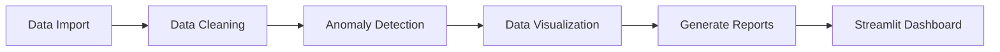

# 📊 Fake Metrics Analyzer

[](https://github.com/GeeksterLab/FakeMetricsAnalyzer/actions)
[](https://codecov.io/gh/GeeksterLab/FakeMetricsAnalyzer)
[](https://pypi.org/project/fake-metrics-analyser)
[](https://fakemetricsanalyser.streamlit.app)

---

## 📖 Table of Contents

1.  [Introduction](#-introduction)  
2.  [Architecture](#-architecture)  
3.  [Project Structure](#-project-structure)  
4.  [Libraries](#-libraries)  
5.  [Installation](#-installation)  
6.  [Usage](#-usage)  
7.  [Streamlit Interface](#-streamlit-interface)  
8.  [Deployment](#-deployment)  
9.  [Reports](#-reports)  
10. [Tests & CI](#-tests--ci)  


---

## 🧐 Introduction

**Fake Metrics Analyzer** is a Python project designed to analyze fake metrics like views and likes on posts to detect anomalies. The project generates detailed reports, provides visualizations (such as a scatter plot of views vs likes), and allows exploration of anomalies and trends in the data.

---

## 🚧 Architecture

Here is a Mermaid diagram that presents the main components and their interactions:



- **Data Import**: Loading view and like data.
- **Data Cleaning**: Preparing and cleaning the data.
- **Anomaly Detection**: Detecting anomalies in the view and like data.
- **Data Visualization**: Generating charts to better understand the data.
- **Generate Reports**: Generating detailed PDF reports outlining the metrics.
- **Streamlit Dashboard**: Interactive interface to explore the analysis results.

---

## 📁 Project Structure

- **assets/**: Contains visual resources such as icons and CSS styles.
- **data/**: Folder containing processed and prepared data.
- **env/**: Virtual environment to manage project dependencies.
- **reports/**: Reports generated during analysis, in PDF format.
- **scripts/**: Python scripts for analysis, anomaly detection, report generation, etc.
- **visualization/**: Contains data visualization scripts and tools.
- **requirements.txt**: List of project dependencies.

---

## 📦 Libraries

* **pandas** → Data management and analysis.
* **matplotlib** → Data visualization (scatter plot, histograms).
* **seaborn** → Advanced data visualization.
* **scikit-learn** → Anomaly detection and statistical models.
* **streamlit** (optional) → For creating an interactive dashboard.
* **fpdf** → PDF report creation.
* **pytest** → Unit and integration testing.
* **numpy** → For mathematical operations and numerical array processing.
* **plotly** (optional) → For creating interactive visualizations.
* **scipy** (optional) → For advanced statistical functions or statistical tests.
* **opencv-python** (optional) → For image processing.

---

## ⚙️ Installation

1. Clone the repository:
```bash
git clone https://github.com/GeeksterLab/Fake_Metrics_Analyzer.git
cd Fake_Metrics_Analyzer
```

2. Create and activate a Python environment:
```bash
python3.10 -m venv env
source env/bin/activate
```

3. Install dependencies:
```bash
pip install -r requirements.txt
```

4. Install the project in development mode:
```bash
pip install -e .
```

---

## 🚀 Usage

1. Run the main script to start the analysis:
```bash
python scripts/main.py
```

2. Launch the Streamlit interface to explore the data interactively:
```bash
streamlit run scripts/streamlit_app.py
```

---

## 🌐 Streamlit Interface

The project includes a **Streamlit** interface that allows you to visualize anomalies in views and likes, as well as explore the metrics from different angles. You will be able to interact with the results through interactive graphs.

To start the **Streamlit** interface, simply run:
```bash
streamlit run scripts/streamlit_app.py
```

The web interface will launch, and you can interact with your data via a visual dashboard.

---

## ☁️  Deployment

- You can try this project on Streamlit instead of installing it locally.

[](https://fakemetricsanalyser.streamlit.app)


---

## 📑 Reports

Analysis results are generated as PDF reports in the **reports/** folder, containing visualizations and statistical summaries.

Example of a generated report:
```bash
./reports/FakeMetrics_Report.pdf
```

---

## 🧪 Tests & CI

To run unit and integration tests:
```bash
pytest --cov=fake_metrics_analyzer --cov-report=term-missing --cov-report=xml
```

---

MIT © 2025 [GeeksterLab]
